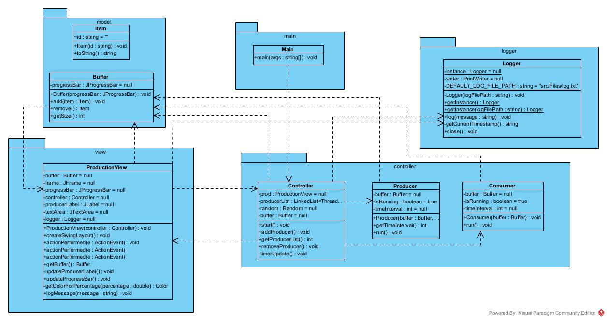

Detta är en Java-baserad applikation som simulerar och styr produktionsprocesserna inom en fabriksmiljö. Programmet ger användarna en interaktiv inblick i hur olika komponenter i en fabrik samverkar för att skapa en produktionslinje. Här är en översikt över de viktigaste klasserna:

    Main: Huvudklassen fungerar som ingångspunkten till programmet. Den initialiserar systemet och startar produktionsprocessen.

    Controller: Kontrollerklassen är hjärnan i systemet och ansvarar för att övervaka och reglera produktionsflödet. Den styr producenter och konsumenter och loggar viktiga händelser.

    Producer och Consumer: Dessa klasser representerar arbetare inom fabriken. Producentsidan skapar produkter, medan konsumenten konsumerar dem. De interagerar med en buffert som fungerar som en temporär lagringsplats för produkter.

    Buffer: Buffertklassen är kärnan i systemet och hanterar lagring och distribution av produkter mellan producenter och konsumenter. Den reglerar flödet av produkter genom fabriken.

    Logger: Loggklassen används för att spåra och registrera händelser inom systemet. Den ger användaren möjlighet att övervaka prestanda och underlätta felsökning.

Vad jag lärt mig genom att utföra detta projektet är hanteringen av trådar inom Java och att skriva och läsa in text från en fil. Detta har varit ett utmanande men roligt projekt.

